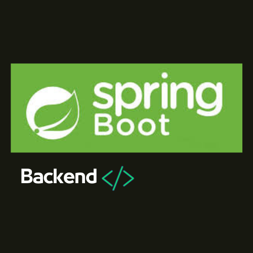

#  Back_end_Spring

##  Tabla de contenido

  - [Acerca de](#acerca-de)
  - [Caracteristicas](#caracteristicas)
  - [Tecnologias Utilizadas](#tecnologias-utilizadas)
 

# Acerca de
Este proyecto presenta una **API RESTful de autenticación y gestión de usuarios** robusta y segura, construida con **Spring Boot**. Diseñada para ofrecer una capa de seguridad fundamental a tus aplicaciones, esta solución maneja eficientemente el ciclo de vida de los usuarios, desde el registro y el inicio de sesión hasta la gestión de sus datos, todo ello respaldado por las mejores prácticas de seguridad.

La implementación se basa en un enfoque moderno, utilizando **JSON Web Tokens (JWT)** para la gestión de sesiones sin estado, lo que garantiza escalabilidad y eficiencia. Para la protección de credenciales, las contraseñas de los usuarios se almacenan de forma segura utilizando el algoritmo de hashing **BCryptPasswordEncoder**, previniendo ataques comunes como el "rainbow table".

La persistencia de datos se gestiona a través de **Spring Data JPA**, facilitando la interacción con la base de datos (configurada para H2 en memoria por defecto para un inicio rápido, fácilmente adaptable a PostgreSQL, MySQL, u otras bases de datos relacionales). El código, escrito en **Kotlin**, es limpio, modular y fácil de entender, lo que facilita su integración y mantenimiento en cualquier proyecto que requiera una autenticación fiable.

---

# Caracteristicas

* **Registro de Usuarios Seguro:** Permite a los nuevos usuarios crear cuentas con validación de datos y almacenamiento seguro de contraseñas utilizando BCrypt.
* **Inicio de Sesión Basado en JWT:** Autenticación de usuarios mediante nombre de usuario y contraseña, generando un JSON Web Token para la gestión de sesiones sin estado.
* **Protección de Endpoints:** Los endpoints de la API están protegidos, requiriendo autenticación JWT para acceder a recursos sensibles.
* **Gestión de Usuarios (CRUD):**
    * Listar todos los usuarios.
    * Obtener un usuario por ID.
    * Actualizar los datos de un usuario.
    * Eliminar un usuario.
* **Manejo de Excepciones:** Respuestas HTTP claras para errores como usuario no encontrado o usuario ya existente.
* **Configuración de Seguridad Flexible:** Integración con Spring Security para una gestión granular de la seguridad.

---

# Tecnologias Utilizadas

* **Spring Boot:** Framework para el desarrollo rápido de aplicaciones Java/Kotlin.

* **Kotlin:** Lenguaje de programación moderno y conciso.
* **Spring Security:** Framework robusto para autenticación y autorización.
* **Spring Data JPA:** Simplifica la implementación de repositorios de acceso a datos.
* **Hibernate:** Implementación de JPA para ORM (Object-Relational Mapping).
* **JSON Web Tokens (JWT):** Estándar para la creación de tokens de acceso seguro.
* **jJWT:** Librería para la implementación de JWT en Java/Kotlin.
* **BCryptPasswordEncoder:** Implementación de hashing de contraseñas.
* **H2 Database:** Base de datos en memoria para desarrollo y pruebas (configurable para producción).
* **Maven:** Herramienta de gestión de dependencias y construcción de proyectos.

JPA Buddy automatiza muchas tareas repetitivas asociadas con el desarrollo de JPA y Spring Data JPA en Kotlin, como la creación de entidades y repositorios.

